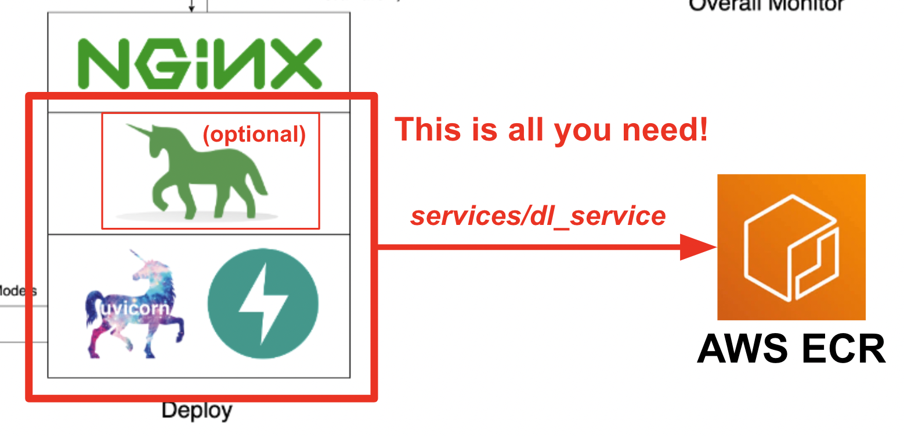
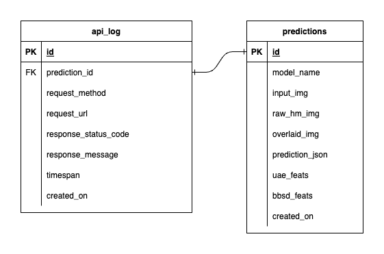

<h1 align="center"> Full-stack On-Premises MLOps system for Computer Vision </h1>

<b>:arrow_forward: 1 config, 1 command from Jupyter Notebook to serve Millions of users :arrow_backward:</b>
  

# Overview
Welcome to our comprehensive on-premises MLOps ecosystem designed specifically for Computer Vision tasks, with a primary focus on image classification. This repository equips you with everything you need, from a development workspace in Jupyter Lab/Notebook to production-level services. The best part? It only takes **"1 config and 1 command"** to run the whole system from building the model to deployment! We've integrated numerous best practices to ensure scalability and reliability while maintaining flexibility. While our primary use case revolves around image classification, our project structure can easily adapt to a wide range of ML/DL developments, even transitioning from on-premises to cloud!

Another goal is to show how to integrate all these tools and make them work together in one full system. If you're interested in specific components or tools, feel free to cherry-pick what suits your project's needs.

The entire system is containerized into a single Docker Compose file. To set it up, all you have to do is run `docker-compose up`! This is a fully on-premises system, which means no need for a cloud account, and it **won't cost you a dime** to use the entire system!

We highly recommend watching the demo videos in the **Demo videos** section to get a comprehensive overview and understand how to apply this system to your projects. These videos contain important details that might be too-long-and-not-clear-enough to covered here.

<image src="./files/software_diagram.png">

# Demo videos
Demo: https://youtu.be/NKil4uzmmQc  
In-dept technical walkthrough: https://youtu.be/l1S5tHuGBA8  
### Resources in the video:
- Model files (ResNet50-based models): [link](https://drive.google.com/file/d/1HFCUCnrTm4MzfkfHtz8_ahh_sVro4qXR/view?usp=sharing)
- Slide: [link](https://docs.google.com/presentation/d/1q5xJdu5v3QekB-1jlX7fC9-zTLLwhXSCBmsq8HMK-p4/edit?usp=sharing)

# Tools / Technologies
To use this repository, you only need Docker. For reference, we use *Docker version 24.0.6, build ed223bc* and *Docker Compose version v2.21.0-desktop.1* on Mac M1.
- Platform: [Docker](https://www.docker.com/) 
- Workspace: [Jupyter Lab](https://jupyter.org/)
- Deep Learning framework: [TensorFlow](https://www.tensorflow.org/)
- Data versioning: [DvC](https://dvc.org/)
- Data validation: [DeepChecks](https://deepchecks.com/)
- Machine Learning platform / Experiment tracking: [MLflow](https://mlflow.org/)
- Pipeline orchestrator: [Prefect](https://www.prefect.io/)
- Machine Learning service deployment: [FastAPI](https://fastapi.tiangolo.com/), [Uvicorn](https://www.uvicorn.org/), [Gunicorn](https://gunicorn.org/), [Nginx](https://www.nginx.com/) (+ HTML, CSS, JS for a simple UI)
- Databases: [PostgreSQL](https://www.postgresql.org/) (SQL), [Prometheus](https://prometheus.io/) (Time-series)
- Machine Learning model monitoring & drift detection: [Evidently](https://www.evidentlyai.com/)
- Overall system monitoring & dashboard: [Grafana](https://grafana.com/)

# Adopted practices
We've implemented several best practices in this project:
- Efficient data loader/pipeline using `tf.data` for TensorFlow
- Image augmentation with `imgaug` lib for greater flexibility in augmentation options than core functions from TensorFlow
- Using `os.env` for important or service-level configs
- Logging with the `logging` module instead of `print`
- Database storage for service response results
- Dynamic configuration through `.env` for variables in `docker-compose.yml`
- Using `default.conf.template` for Nginx to elegantly apply environment variables in Nginx config (new feature in Nginx 1.19)
- Configuration of Nginx for terminal log display
- Setting up a Prefect worker to support working on a cluster

# Service ports
Most of the ports can be customized in the .env file at the root of this repository. Here are the defaults:
- JupyterLab: 8888 (pw: `123456789`)
- MLflow: 5050
- Prefect: 4200
- PostgreSQL: 5432
- PGagmin: 16543 (user: `pgadmin@gmail.com`, pw: `SuperSecurePwdHere`)
- Deep Learning service: 4242
- Web UI interface for Deep Learning service: 4243
- Nginx: 80
- Evidently: 8000
- Prometheus: 9090
- Grafana: 3000 (user: `admin`, pw: `admin`)

# How to use
You have to consider comment those `platform: linux/arm64` lines in `docker-compose.yml` if you not using an ARM-based computer (we're using Mac M1 for development). Otherwise, this system is not gonna work.
## Setup
1. Clone this repo. There are 2 submodules in this repo, so consider using `--recurse-submodules` flag in your command: `git clone --recurse-submodules https://github.com/jomariya23156/full-stack-on-prem-cv-mlops`
2. **[For users with CUDA]** If you have CUDA-compatible GPU(s), you can uncomment `deploy` section under `jupyter` service in `docker-compose.yml` and change the base image in `services/jupyter/Dockerfile` from `ubuntu:18.04` to `nvidia/cuda:11.4.3-cudnn8-devel-ubuntu20.04` (the text is there in the file, you just need to comment and uncomment) to leverage your GPU(s). You might also need to install `nvidia-container-toolkit` on the host machine to make it work. For Windows/WSL2 users, we found [this article](https://medium.com/htc-research-engineering-blog/nvidia-docker-on-wsl2-f891dfe34ab) very helpful.
3. At the root of the repo directory, run `docker-compose up` or `docker-compose up -d` to detach the terminal.
4. On the first time, it can take a while due to the size of images, especially jupyter image since it contains a lot of packages and libraries. Generally, it can take from 5 up to 20 minutes.
5. Go to the DvC submodule at `datasets/animals10-dvc` and follow steps in the **How to use** section.
## Minimal usage
1. Open the Jupyter lab on port 8888 `http://localhost:8888/lab`
2. Go to the workspace directory `cd ~/workspace/`
3. Activate the conda environment (the name is configurable in `docker-compose.yml`) `conda activate computer-viz-dl`
4. Run `python run_flow.py --config configs/full_flow_config.yaml`
5. Sit back and watch your brand-new classifier is built, trained, evaluated, deployed (at scale), and monitored on a fully-operating system!
## Customization
- There are a lot of things working together, and it's hard to talk into detail in every bit. There is no better way than getting your hands dirty aka read codes, try to understand, and try customizing it yourself!
- Anyways, there are some guidelines you can follow to make components work all together seamlessly as they should:
    - Your tasks should be created inside the `tasks` directory
    - All your tasks are supposed to be called from the flows which are created inside the `flows` directory
    - Your flows should be called with `run_flow.py` at the root of the repo.
    - In order to be called this way, you have to implement `start(config)` function in your flow file. This function accepts the config as a Python dict and then basically calls the specific flow in that file.
    - Datasets should live inside the `datasets` directory and they all should have the same directory structure as the one inside this repo.
    - `central_storage` at `~/ariya/` should contain at least 2 subdirectories named `models` and `ref_data`. This `central_storage` serves the object storage purpose of storing all staged files to be used across developing and deploying environments. (This is one of the things you could consider changing to a cloud storage service in case you want to deploy on-cloud and make it more scalable)
  
**IMPORTANT** Conventions to be **SUPER EXTRA CAREFUL** if you want to change (because these things are tied and used in different parts of the system):
  - `central_storage` path -> inside there should be `models/` `ref_data/` subdirectories
  - File naming in central_storage e.g. `<model_name>.yaml`,  `<model_name>_uae`, `<model_name>_bbsd`, `<model_name>_ref_data.parquet`
  - All database schemas (columns) -> they are linked in many places (mainly dl_service, prefect_worker/repo, evidently)
  - Key/Name of Prefect Variables `current_model_metadata_file` and `monitor_pool_name`
  - Prefect version 2.13.2, there are bugs in templating prefect.yaml file and they got fixed in this version. So if not necessary, don’t go below this version otherwise, you need to make changes to Prefect-related files.
  - Evidently version 0.4.5, the mmd’s bug, which we uses as a method for embedding drift detection, got fixed in this version. Again if you want to change the version, try not to go below 0.4.5.

# How everything works together
- **Jupyter Lab** serves as your workspace for coding. It includes a pre-installed Conda environment named `computer-viz-dl` (default value), with all the required packages for this repository. All the Python commands/codes are supposed to be run within this Jupyter.
- **Prefect** orchestrates all main execution codes, including tasks and flows.
- The `central_storage` volume acts as the central file storage used throughout development and deployment. It mainly contains model files (including drift detectors) and reference data in Parquet format. At the end of the model training step, new models are saved here, and the deployment service pulls models from this location. (*Note*: This is an ideal place to replace with cloud storage services for scalability.)
- These are the step-by-step explanation of what happen when you run the full flow. The full comprises of 3 subflows; train, evaluate, deploy running sequentially. Each flow has its own set of config file, it can be a dedicated .yaml file for each flow or it can be only 1 .yaml file for the full flow (take a look at files in *config* folder):
    1. Train flow
       1. Read the config.
       2. Use the `model` section in the config to build a classifier model. The model is built with **TensorFlow** and its architecture is hardcoded at `tasks/model.py:build_model`.
       3. Use the `dataset` section in the config to prepare a dataset for training. **DvC** is used in this step to check the consistency of the data in the disk compared with the version specified in the config. If there are changes, it converts it back to the specified version programmatically. If you want to keep the changes, in case you're experimenting with the dataset, you can set `dvc_checkout` field in the config to *false* so that DvC won't do its things.
       4. **DeepChecks** then validates the prepared dataset and save the result report. You can add some conditions in this step. For example, if some serious tests fail, terminate the process so that it doesn't train a bad model.
       5. Use the `train` section in the config to build a data loader and start the training process. Experiments info and artifacts are tracked and logged with **MLflow**. Note: the result report (in *.html* file) from DeepChecks is also uploaded to the training experiment on MLflow for convention.
       6. Build the model metadata file from the `model` section in the config.
       7. Save the trained model and its corresponding metadata file to local disk.
       8. Upload the model and model metadata files to `central_storage` (in this case, it's just making a copy to `central_storage` location. This is the step you can change to uploading files to cloud storage)
       9. Build drift detectors based on the trained model and the `model/drift_detection` section in the config.
       10. Save and upload the drift detectors to `central_storage`.
       11. Generate a reference data using the drift detectors and the dataset.
       12. Save the reference data in *.parquet* and upload it to `central_storage`.
       13. Return the path to uploaded models and model metadata file for the next flow.
    2. Evaluation flow
       1. Load saved models and model metadata file.
       2. Prepare a dataset for testing (reuse the same task as in train flow)
       3. Build a data loader from the config and evaluate the model 
       4. Log the results to **MLflow**
    3. Deployment flow
       1. *PUT* request to trigger the running service (served with **FastAPI** + **Uvicorn** + **Gunicorn** + **Nginx**) to fetch the newly trained model from `central_storage`. (this is one concern discussed in the tutorial demo video, watch it for more detail)
       2. Create or update, if's already existed, Prefect variables for monitoring configuration. Mainly 2 variables which are `current_model_metadata_file` storing model metadata file name ended with *.yaml* and `monitor_pool_name` storing the work pool name for deploying Prefect worker and flows.
       3. Deploy the Prefect monitor flow which internally fetches the data from **PostgreSQL** and uses **Evidently** to compute data drift related reports and metrcs. Programmatically `cd` into `deployments/prefect-deployments` and run `prefect --no-prompt deploy --name {deploy_name}` using inputs from the `deploy/prefect` section in the config.
       4. The monitor flow is schedule to run weekly aka once a week. But you can run the deployed flow manually from Prefect UI. Check out their official doc on how to do this (pretty simple and straight forward)
       5. You can also view the data drift dashboard on Evidently UI (port 8000, by default)

# From On-Premises to On-Cloud
Since everything is already dockerized and containerized in this repo, converting the service from on-prem to on-cloud is pretty much straightforward. When you finish developing and testing your service API, you can just spin off *services/dl_service* by building the container from its Dockerfile, and push it to a cloud container registry service (AWS ECR, for an example). That's it!  
**Note:** There is one potential problem in the service code if you want to use it in a real production environment. I have addressed it in the [in-depth video]() and I recommend you to spend some time on watching the whole video.  

# DB schemas
We have three databases inside PostgreSQL: one for MLflow, one for Prefect, and one that we've created for our ML model service. We won't delve into the first two, as they are self-managed by those tools. The database for our ML model service is the one we've designed ourselves.  

To avoid overwhelming complexity, we've kept it simple with only two tables. The relationships and attributes are shown in the ERD below. Essentially, we aim to store essential details about incoming requests and our service's responses. All these tables are created and manipulated automatically, so you don't need to worry about manual setup.

Noteworthy: `input_img`, `raw_hm_img`, and `overlaid_img` are base64-encoded images stored as string. `uae_feats` and `bbsd_feats` are arrays of embedding features for our drift detection algorithms.

